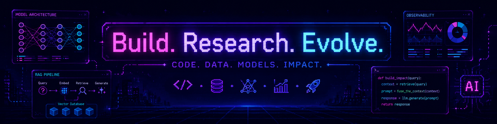
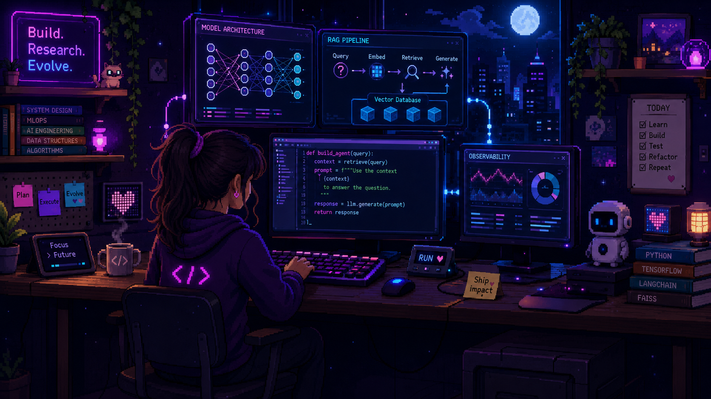

# Hey there! 👋 I'm Niharika Aggarwal

### ✨ GenAI / AI Engineer · Researcher · Systems Thinker · Full-Stack Developer

  

  

  

---

## 🌱 Current Focus

I build intelligent, scalable systems around:

- Retrieval-Augmented Generation and Graph RAG
- LLM applications, agents and tool calling
- Semantic search, reranking and vector databases
- Multilingual OCR and document-ingestion pipelines
- Distributed processing with Celery and RabbitMQ
- Full-stack AI applications with React and FastAPI
- System architecture, deployment and observability

---

## 🎞️ AI Engineering Workspace

  

> Add your animated file to the repository with the exact filename `githubgif.gif`.

---

## 👩‍💻 Featured Work

### 🧠 AI-Powered Slide Retrieval System

A scalable slide-ingestion and semantic retrieval platform using Qdrant, SQLite, HyDE, vLLM, RabbitMQ, Celery workers and multilingual OCR.

**Highlights:**

- PowerPoint and PDF ingestion
- Slide rendering, OCR and text extraction
- Embeddings, reranking and semantic retrieval
- User-scoped search and data isolation
- Parallelized processing and ingestion-time tracking
- Dockerized infrastructure and worker pipelines

### 🏭 Gen-EAMlytics

A GenAI framework for analysing ArchiMate-based enterprise architecture models in manufacturing using Graph RAG, Neo4j, FastAPI, React and TypeScript.

### 🎨 Interactive 3D Portfolio

An immersive portfolio with animated states for AI engineering, research, systems thinking and full-stack development.

🔗 [Open the portfolio](https://niharika-3-d-portfolio.vercel.app/)  
🔗 [View the repository](https://github.com/niharika830/niharika-3-d-portfolio)

---

## 🛠️ Languages and Tools

  

  LangChain · LangGraph · LlamaIndex · Haystack · Hugging Face · BAML · Ollama · vLLM · Qdrant · Chroma · Neo4j · Celery · OCR · RAGAS

---

## 📊 GitHub Statistics

 

---

## 📈 Contribution Activity

  

---

## 🐍 Contribution Snake

  <picture>
    <source media="(prefers-color-scheme: dark)" srcset="https://raw.githubusercontent.com/niharika830/niharika830/output/github-contribution-grid-snake-dark.svg"/>
    <source media="(prefers-color-scheme: light)" srcset="https://raw.githubusercontent.com/niharika830/niharika830/output/github-contribution-grid-snake.svg"/>
    
  </picture>

---

## 🤝 Let's Connect

**Build. Research. Evolve. 🚀**

 

